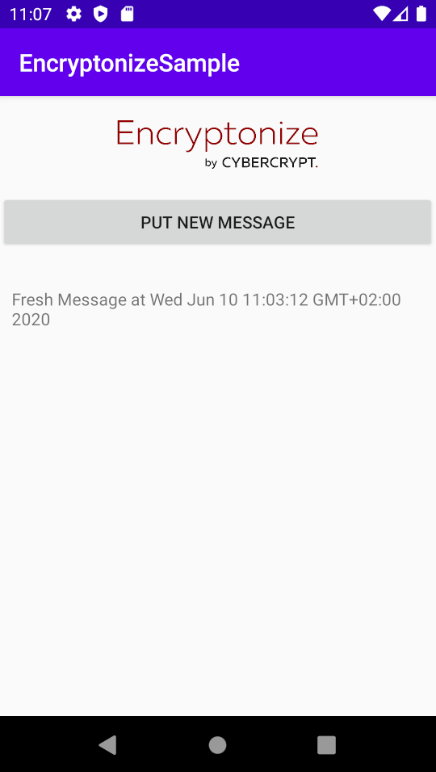
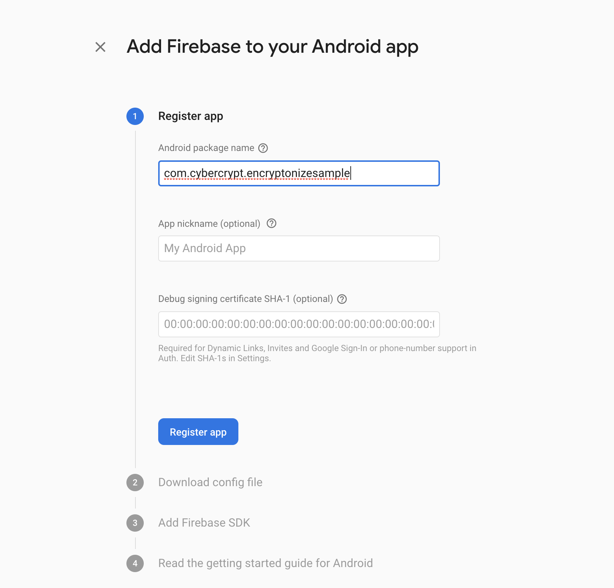

# Encryptonize Kotlin Example

This example Android app uses Google Firebase Firestore to exchange and store messages that are encrypted by the Encryptonize API.

## Features

The app includes a basic UI:
* By clicking "PUT NEW MESSAGE", a new message will be created (simply including the current date and time),
encrypted and stored in Firestore.
* Any new message in Firestore (with a specific type) will be displayed below the button.



The data structure in Firestore is as follows

```
{
    device_id: String (UUID of the device so we might determine the sender)
    message_type: String (for subscribing to messages of a given type)
    content: String (Base64 encoded, encrypted message content)
    created_at: Date (for ordering messages for our purposes)
}
```

Our firestore collection is called `shared-secrets`, and we listen for messages of type `demo_type`.

## Building and Running

To run the app, you need to:
* Create a Firebase Project, and follow the instructions in the Firebase Console to add Firebase to the App

* Use the app's identifier `com.cybercrypt.encryptonizesample` in your Firebase Settings
* Drop your own `google-services.json` into the `app` folder.
* Setup a Firestore Collection called `shared-secrets` (please see https://firebase.google.com/docs/firestore/quickstart).
* Configure your own ApiToken, GroupId and UserId in [`MainActivity.kt`](./app/src/main/java/com/cybercrypt/encryptonizesample/MainActivity.kt).

With these preconditions fulfilled, you can build and run the app in Android Studio.  
You can now run the app on multiple phones to observe that the synchronization and group encryption works.


